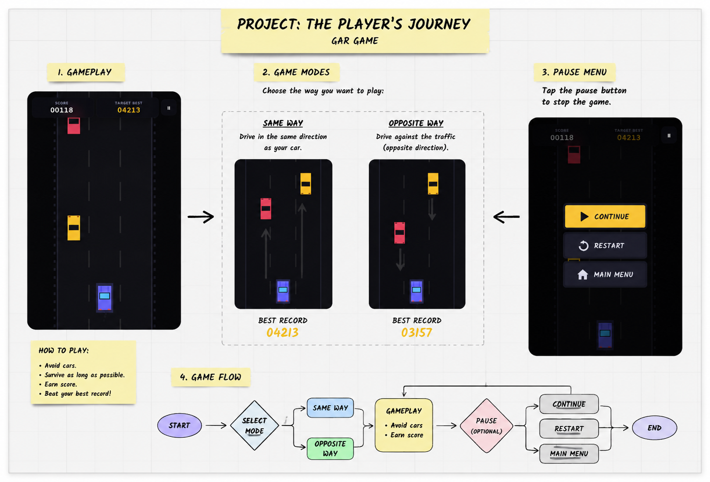

# 🚗 HyperDrive Pro

> **High-Speed Traffic Simulation** — dodge traffic, chain near-misses, unlock 20 cars, and chase the leaderboard.

🎮 **[Play Live on GitHub Pages](https://miko44quliyev.github.io/mini-car-game/)**

📓 **[Read the AI Diary](./AI_DIARY.md)**

---

## 📋 Table of Contents

- [Game Description](#game-description)
- [Entities](#entities)
- [Excalidraw Sketch](#excalidraw-sketch)
- [How to Play](#how-to-play)
- [Tech Decisions](#tech-decisions)
- [Known Bugs / What I'd Fix Next](#known-bugs--whats-id-fix-next)

---

## Game Description

HyperDrive Pro is a top-down endless traffic racer built entirely with vanilla HTML5 Canvas and JavaScript — no libraries, no frameworks, no build tools.

You pick one of **20 unlockable cars** (Tier D through Tier S) and drive down a 3-lane highway that gets faster the longer you survive. Traffic spawns ahead of you — you weave through it, trigger **near-miss combos**, fire **nitro boosts**, and try to beat your own record.

Coins earned each run are saved to `localStorage` and spent in the **Garage** to unlock faster, better-handling cars. One-time **Milestone bonuses** reward hitting score thresholds for the first time (e.g. reaching 1,000 points drops 200 bonus coins). Two traffic modes (Same-Way / Head-On) and three difficulty levels (Easy / Normal / Insane) give it real replay depth.

The game works completely offline — open the HTML file directly in a browser, no server needed.

---

## Entities

| Entity | What it does |
|---|---|
| **Player Car** | Controlled by the player. Moves left/right across 3 lanes using keyboard or touch. Has a hitbox, nitro bar, and exhaust particle trail. Rendered using a real car sprite image. |
| **Traffic Cars** | Obstacles that spawn at the top of the road and move downward (SAME-WAY) or upward toward you (HEAD-ON). Each one uses a random sprite from the 20-car roster. |
| **Nitro Bar** | A depletable resource (0–100). Holding Space or Shift activates a speed multiplier and score boost. Recharges slowly after depleting. Goes into a cooldown state when fully drained. |
| **Combo Counter** | Increments every time you get a near-miss. Resets after ~3 seconds of no action. Each combo level adds 10% to your score gain and increases the near-miss point bonus. |
| **Particles** | Two systems: exhaust smoke trails behind the player car, and an explosion burst on crash. Pure canvas, no images. |
| **Road & Lane Lines** | Scrolling white dashes and roadside lamp posts that create the illusion of forward movement. Scroll speed matches `gameSpeed`. |
| **Rain Overlay** | Procedural rain drops drawn in NORMAL and INSANE difficulties. Visual only — doesn't affect gameplay, but adds atmosphere. |
| **Coin Economy** | Coins per run = base score ÷ 15 + near-miss bonuses + combo bonuses, multiplied by difficulty and mode modifiers. Stored in `localStorage`. |
| **Milestone Rewards** | 9 one-time score thresholds (100 pts → 100,000 pts). Each fires once ever and deposits bonus coins. Tracked with individual `localStorage` flags. |
| **Garage** | A full car selection screen with a horizontal scrolling strip, per-car stat bars (Speed, Handling, Nitro, Accel), price tag, and buy/select/locked states. |

---

## Excalidraw Sketch

> 

```
┌──────────────────────────────────────┐
│  SCORE: 04280        BEST: 06100     │  ← HUD bar
│  [████████░░] NITRO     ×3 COMBO     │
├──────────────────────────────────────┤
│                                      │
│  ║  ┌────┐         ┌────┐  ║        │
│  ║  │ 🚙 │         │ 🚗 │  ║        │  ← 3-lane road
│  ║  └────┘         └────┘  ║        │     with traffic
│  ║                          ║        │
│  ║         ╔══════╗         ║        │
│  ║         ║  🏎  ║         ║        │  ← Player car
│  ║         ╚══════╝         ║        │
│  ║   · · · · · · · · ·      ║        │  ← Lane lines
├──────────────────────────────────────┤
│        [GARAGE]  [PLAY]              │  ← Start screen
└──────────────────────────────────────┘
```

---

## How to Play

### Controls

| Key / Input | Action |
|---|---|
| `A` or `←` | Move car left |
| `D` or `→` | Move car right |
| `Space` or `Shift` | Hold to activate nitro boost |
| `Escape` | Pause / Resume |
| Swipe left/right (mobile) | Steer |
| Touch right side of screen | Nitro (mobile) |

### Objective

Survive as long as possible without hitting any traffic car. The road accelerates continuously — the longer you last, the faster and more chaotic it gets. Your score climbs every frame based on current speed, so survival time is everything.

### Scoring

| Action | Points |
|---|---|
| Surviving | `gameSpeed × 0.06` per frame (grows as speed increases) |
| Near-miss | `+15 × current combo level` |
| Nitro active | Score multiplier applied on top of base gain |
| Combo | Each chained near-miss adds 10% more score per frame |

### Win / Lose

- **Lose:** your car's bounding box overlaps any traffic car → explosion → Game Over
- **Win:** there is no ceiling — it's an endless score chaser. Beat your personal record.

### Modes

| Mode | Description |
|---|---|
| **SAME-WAY FLOW** | Traffic moves in your direction. Easier relative speeds. Better for learning. |
| **HEAD-ON OPPOSITE** | Traffic rushes straight at you. Much higher closing speeds. Score multiplier ×1.3. |

### Difficulty

| Difficulty | Spawn rate | Traffic speed | Coins earned | Rain |
|---|---|---|---|---|
| EASY | Low | ×0.7 | ×0.8 | None |
| NORMAL | Medium | ×1.0 | ×1.0 | Light |
| INSANE | High | ×1.4 | ×1.5 | Heavy |

---

## Tech Decisions

### Functional, not OOP

The game is written in a **functional / procedural style** — no classes, no `this`. All state lives in top-level `let` variables (`score`, `gameSpeed`, `obstacles`, `particles`, etc.) and all logic is plain functions (`update()`, `draw()`, `startGame()`, `triggerCrash()`).

**Why this worked here:**
- A canvas game with one player and a flat list of obstacles doesn't need inheritance or polymorphism. There's no deep object hierarchy to manage.
- The game loop is a tight sequential pipeline: `update → draw → requestAnimationFrame`. Plain functions read naturally in that context — you can follow exactly what happens every frame top to bottom.
- Resetting the game is trivial: just reassign the variables in `startGame()`. No need to reconstruct class instances or manage object lifetimes.

**Where OOP would have helped:**
- If cars had unique behaviour (special abilities, different trail effects, boss logic), a `Car` class with a `render()` method would have been cleaner.
- A `ParticleSystem` class would have been better than the raw `particles[]` array with scattered push/splice logic.


### Web Audio API — zero-file sound engine

All 10 sound effects are **synthesised in real time** using the Web Audio API — no `.mp3` or `.ogg` files, no CDN, no loading time.

| Sound | Technique |
|---|---|
| Engine hum | Continuous sawtooth oscillator, frequency maps to `gameSpeed` (60–220 Hz), LFO tremolo for pulse |
| Nitro activate | Bandpass-swept noise burst (300→3200 Hz) + engine pitch surge |
| Nitro depleted | 3 low-pass noise sputters with staggered timing |
| Near miss | Descending sine + triangle tones simulating doppler, short noise whoosh |
| Combo up | 3-note ascending triangle chime, base pitch scales with combo level |
| Crash | Distorted waveshaper noise + 60 Hz sub-bass sine + high crack burst |
| New record | 4-note fanfare (C5 E5 G5 C6) with harmonic fifth layer |
| Coin | Two short sine tones at a musical interval |
| Menu click | Sine pop + noise transient |
| Countdown | Square wave beeps at 440 Hz, double 880 Hz "GO!" |

`SFX.boot()` creates the `AudioContext` on the first user gesture (required by browsers). The engine oscillator runs continuously while playing and its pitch tracks `gameSpeed` every frame via `SFX.tickEngine()`. A `COUNTDOWN` game state freezes physics until the 3 beeps complete before the engine starts.

### Canvas + HTML overlay

Everything visual except the UI is drawn on a single `<canvas>` element every frame. Buttons, score text, and screens live in an HTML `#ui-layer` div on top of the canvas.

This split means:
- The canvas handles only animation — no text rendering, no layout
- Buttons stay accessible (keyboard-focusable, screenreader-friendly)
- Screens can fade in/out with CSS transitions without touching the canvas

### Sprite Sheet

Traffic car images are sliced from a single **1024×1536px sprite sheet** (4 columns × 5 rows = 20 cars) using a Python/Pillow script during development, then **embedded as base64 data URIs** directly in `game.js`.

Benefits:
- Zero extra HTTP requests — the game is a single JS file that works on `file://` with no server
- No CORS issues
- Works offline

Trade-off: `game.js` is ~860 KB (mostly image data). For a production deployment, the images would be hosted separately.

### localStorage Schema

```
hd_wallet                    → number   (total coins)
hd_owned                     → string[] (array of owned car IDs)
hd_selected                  → string   (currently selected car ID)
hd_record_SAME_WAY_NORMAL    → number   (high score per mode+difficulty)
hd_record_SAME_WAY_EASY      → number
hd_record_OPPOSITE_INSANE    → number
... (one key per mode/difficulty combo)
hd_ms_ms_500                 → boolean  (milestone claimed flag)
hd_ms_ms_1000                → boolean
... (one key per milestone)
```

---

## Known Bugs / What I'd Fix Next

| # | Issue | Severity | Notes |
|---|---|---|---|
| 1 | **Sprite sheet crop alignment** — some sprites have a sliver of the neighbouring car visible at the edge because the sheet doesn't divide into perfectly equal cells. | Low | Fix by manually defining crop coordinates per sprite instead of using equal divisions. |
| 2 | **Traffic cars can stack in the same lane** — the spawn check only tests if the last obstacle's Y > 180, so two cars can appear side-by-side making a lane impossible to dodge. | Medium | Add a per-lane cooldown before spawning into that lane again. |
| 3 | **Nitro touch zone is fragile on mobile** — right-side touch detection uses a canvas-relative threshold that breaks when the page is zoomed or on wide screens. | Medium | Replace with explicit on-screen arrow and nitro buttons. |
| 4 | **Game Over screen shows before explosion finishes** — `triggerCrash()` shows the overlay immediately while particles are still playing. | Low | Delay the screen by 400ms to let the explosion animate first. |
| 5 | **Garage doesn't scroll on short screens** — on phones under ~700px tall the bottom of the garage is cut off. | Low | Add `overflow-y: scroll` to the garage panel and reduce card size on mobile. |
| 6 | **game.js is 860 KB** — most of it is base64 image data. Slow to parse on weak devices. | Medium | Host images separately or use a real spritesheet with canvas `drawImage` clipping instead of base64 per car. |

---

*Built with vanilla HTML5 Canvas, CSS3, and JavaScript. No frameworks. No build tools. No dependencies.*
